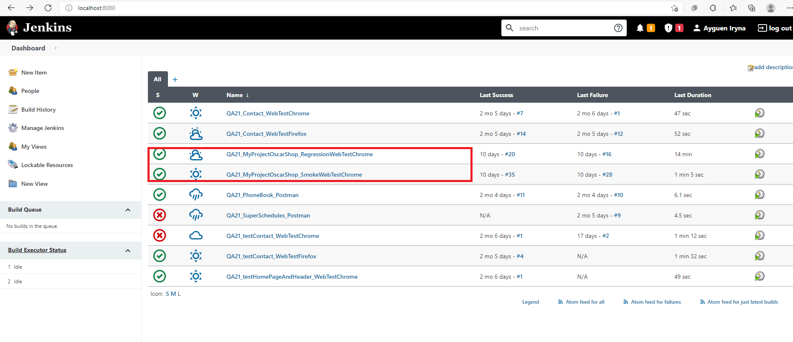

# Selenium project is intendet to test website *OscarShop*

---------------------------------------------------------------

This is the web test automation project for website testing.

OscarShop website is under development. The site can be seen   **[here](http://selenium1py.pythonanywhere.com)**.

This project is written in **Java**  with  **Selenium** driver  and  uses  **Gradle** test builder  and  **TestNG** framework for testrunning.

To execute the tests just browse to the path where the QA21_MyProject_POM is located **via terminal** and type ***gradlew clean testSmoke*** (for Smoke suite) or ***gradlew clean testRegression*** (for Regression suite) or execute the tests in **Intellij IDEA** (or your IDE). 

Moreover tests can be run in continuous software integration process system **Jenkins**. 

The Project will use **Chrome Browser**.

### Prerequisites Software/Tools:

- IDE for Java (Intellij IDEA), Java Development Kit (Java 11), Chrome browser/ Chromedriver, 
- Selenium framework,  Gradle-7.2 test builder, TestNG framework for testrunning,
 
fragment of code in build.gradle:
```
dependencies {
    implementation 'org.seleniumhq.selenium:selenium-java:3.141.59'
    implementation 'org.testng:testng:7.4.0'
    implementation 'ch.qos.logback:logback-classic:1.2.3'
}
test {
    useTestNG()
}
```
- continuous software integration process system Jenkins. 

### The Project uses Page Object Model Pattern.

Page Object Model (POM) is a design pattern, popularly used in test automation that creates Object Repository for web UI elements.

Base Pages are **HomePage, Login/RegistrationPage, ProductPage, BasketPage** and **PageBase**, which contains  common for all Classes methods.

There are positive and negative tests for **HomePage, login, register, products list, product, user profile, address book, order history**
and **Smoke test** in the project. All tests have  Asserts.

### Project features and benefits.

- **Logger** bibliothek protocol test running.  *Logback.xml* file create *xxx.log* files with reports in */src/test_logs*. The xxx.log files will be named with a combination of "log-" + "dd'T'HHmmss" + ".log".
- **DataProvider** uses two  *xxx.csv* files in */src/test/resources* for negative tests of registration and login.
- **Screenshot** can be taken on test failure and stored under */screenshot*. The screenshot files will be named with a combination of
 *"screen-"+System.currentTimeMillis+".png"*.
- **Listener** give in report information about *name of current test, founded webelements, success of test* for more clear overview of the test execution.
- **PropertiesLoader** enable  take static data of project from *test.properties* file in */src/test/resources* , for example, url, valid.email, valid.password.
- **Data** of user, product, shipping adress are centraliyed in corresponding classes in */src/test/java/com.telran.oscarshop/data*. 
 It gives you the possibility to edit the input data in one place without messing around with project code.
- Smoke  and regression test suites can be runned in **Jenkins** system.

### Tests running in Jenkins

1. To run Jenkins just browse to the path where the **jenkins.war** is located **via terminal** 

   and type ***java -jar jenkins.war***;

2. Type in Google ***localhost:8080***, <Enter>;

3. Input **login** and **password** for Jenkins, <Sign in>;

4. Create a new **Item** on Dashboard for **OscarShop_SmokeWebTestChrome** with configuration parameters:
   - Source Code Management = Git; 
   - Repository URL = https://github.com/IrynaAyguen/QA21_MyProject_POM ; 
   - Branches to build = * / *;
   - Build = Invoke Gradle; Gradle Version = gradle-7.2; Tasks= clean testSmoke.
  
  
  
5. Click on  Build Now ; 
  
6. View a result of build in Console Output.
  
  
  
7. Repeade 4. for new **Item** on Dashboard for **OscarShop_RegressionWebTestChrome**, but Tasks= clean testRegression. 
  
  Repeade 5. and 6. for  **OscarShop_RegressionWebTestChrome** Item.
  
   
  

 -------------------------------------------------- 
  
Contributors Iryna Ayguen iryna.ayguen2021@gmail.com
